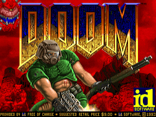
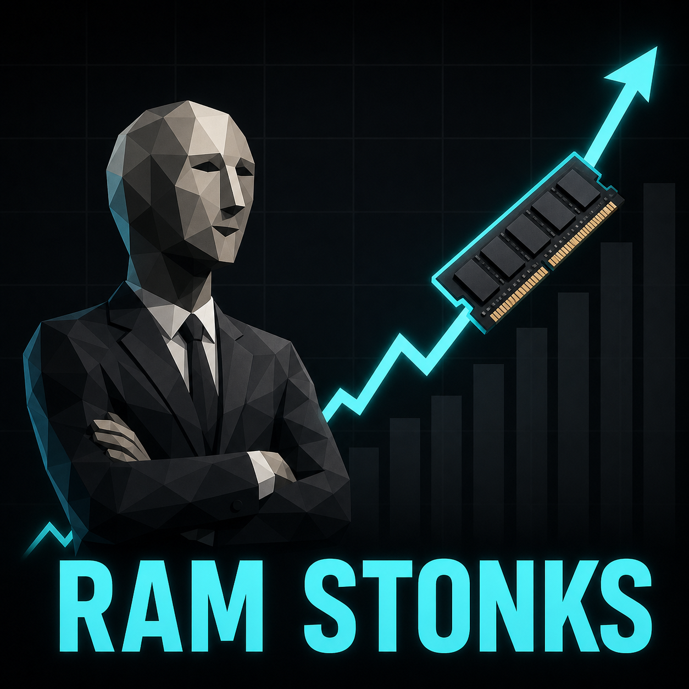
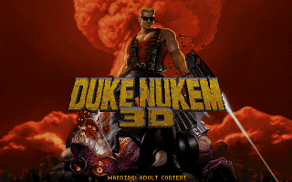

<div class="eyebrow">15-minute lightning talk</div>

# Learning AI Without a Recipe

<p class="lede">How a pile of experiments turned into AI manipulating a game.</p>



<!--
Speaker notes:
Open with the honest framing: this was not a planned research program.
It started with curiosity, hardware, local models, and one question that kept getting more concrete.
-->

---

## About Me: Raúl Correia

- Senior Software Engineer.
- Mostly backend and serverless background.
- GitHub: `github.com/raulcorreia7`
- I did not learn AI from a fixed recipe.
- Experimentation.

<!--
Speaker notes:
Keep this personal and quick. The background matters because the project came from systems instincts: boundaries, protocols, runtime behavior, and making things observable.
-->

---

## Talos

<p class="subtle">My computers get Greek names. Talos was the bronze automaton guarding Crete.</p>

<div class="grid">
  <div class="panel">
    <h3>CPU</h3>
    <p>Ryzen 9 9950X3D</p>
  </div>
  <div class="panel">
    <h3>Memory</h3>
    <p>96GB RAM</p>
  </div>
  <div class="panel">
    <h3>GPU</h3>
    <p>Nvidia RTX 5090 32GB</p>
  </div>
  <div class="panel asset-card">
    <div>
    <h3>RAM prices</h3>
      <p>96GB 6000MHz CL30 -> €300 at the time.</p>
    </div>
    
  </div>
</div>

<!--
Speaker notes:
I name my computers after Greek mythological figures. Talos was the giant bronze automaton made by Hephaestus to guard Crete. The hardware mattered because it changed the feedback loop: I could run models, compare them, and see where they fell apart.
-->

---

## Model Playground

<div class="split">
  <div>
    <h3>Local</h3>
    <ul>
      <li>Qwen 3 / Qwen 3.5</li>
      <li><strong>Qwen3.5 9B</strong></li>
      <li>Qwen3.5 27B</li>
      <li>Qwen3.5 35B-A3B</li>
      <li>gpt-oss-20b / gpt-oss-120b</li>
    </ul>
  </div>
  <div class="divider"></div>
  <div>
    <h3>Hosted</h3>
    <ul>
      <li>Kimi K2 / Kimi K2.5</li>
      <li>DeepSeek V3</li>
      <li>GLM 5 / GLM 5.1</li>
      <li>ChatGPT 5.4 / 5.5</li>
      <li>Different failure modes</li>
    </ul>
  </div>
</div>

<p class="small">The most interesting part was finding the sweet spot for local models: size, intelligence, and tool-use reliability.</p>

<!--
Speaker notes:
Do not present this as a formal evaluation. This is the experimentation phase: different models, different personalities, different failure modes.
Later in the talk, call out Qwen3.5 9B specifically: it was small enough to run locally, but still capable enough to act as a surprisingly smart orchestrator brain for the game loop.
-->

---

## First Attempts

<div class="image-split">
  <div>
    <ul>
      <li>Started with <strong>Duke3D</strong>: built an asset extractor.</li>
      <li>Converted old image formats into BMP, PNG, and TGA.</li>
      <li>The scope got too big: upscaling images, cloning voices, adding content live.</li>
    </ul>
  </div>
  
</div>

<!--
Speaker notes:
The important lesson is that the first engine was not the final answer. Duke3D started as an asset pipeline problem: extraction, image conversion, upscaling, and even on-the-fly voice cloning. That was exciting, but too broad. The sharper version was: can an LLM inspect and control the running game?
-->

---

# <span class="mark">What if</span> AI could breathe fresh air into an <span class="mark">old game</span>?

<p class="lede">An LLM orchestrating the game and changing its rules dynamically.</p>

<!--
Speaker notes:
This is the turn. The idea moved from "play with models" to "give a model a world it can inspect and change."
-->

---

## Pseudo Game Loop

<pre class="tree"><span class="root">game</span>
└─ <span class="root">game loop</span>
   ├─ <span class="fn">tick()</span>
   │  ├─ <span class="note">state:</span> player, entities, inventory, map
   │  └─ <span class="note">actions:</span> input, commands
   └─ <span class="fn">render()</span>
      └─ frame output</pre>

<p class="lede">The hard part is making this maintainable across engines, C code, and C++ protocol layers.</p>

<!--
Speaker notes:
Use this slide as the quick architecture analysis. A game is already a structured simulation; pixels are just one output.
-->

---

## Where to Hook

<pre class="tree"><span class="root">game</span>
├─ <span class="fn">startup</span>
│  └─ <span class="hook">DMCP_Init(config)</span>
├─ <span class="root">game loop</span>
│  ├─ <span class="fn">tick()</span>
│  │  └─ <span class="hook">DMCP_Tick()</span>
│  └─ <span class="fn">render()</span>
│     └─ <span class="hook">DMCP_CaptureFrame()</span>
└─ <span class="fn">shutdown</span>
   └─ <span class="hook">DMCP_Shutdown()</span></pre>

<p class="small">In this repo, Crispy Doom calls these through the small engine-facing hook API.</p>

<!--
Speaker notes:
Point to the concrete hooks without going into code. Startup creates the bridge. Tick publishes state and drains commands. Frame capture exists as a hook, but release builds do not expose screenshots right now.
-->

---

## Hook: Init

```c
void D_DoomMain(void)              // src/doom/d_main.c
{
    // Doom selects the initial game or title state.

#ifdef DMCP
    dmcp_config = DMCP_ParseArgs(myargc, myargv);
    DMCP_Init(dmcp_config);
#endif

    D_DoomLoop();  // never returns
}
```

<p class="small">DMCP starts once, before Doom enters the main loop.</p>

<!--
Speaker notes:
This is the startup hook: parse DMCP command-line options, initialize the bridge, then let Doom continue into its normal infinite loop.
-->

---

## Hook: Tick

```c
void G_Ticker(void)                // src/doom/g_game.c
{
    switch (gamestate)
    {
        // Doom advances the current state:
        // level, intermission, finale, or demo screen.
    }

#ifdef DMCP
    DMCP_Tick();
#endif
}
```

<p class="small">The agent bridge runs after Doom advances its simulation tick.</p>

<!--
Speaker notes:
The tick hook is where DMCP can publish fresh state and drain queued commands in sync with Doom's own simulation update.
-->

---

## Hook: Render

```c
void D_DoomLoop(void)              // src/doom/d_main.c
{
    TryRunTics();

    if (screenvisible && !nodrawers)
    {
        D_Display();
        I_FinishUpdate();

#ifdef DMCP
        DMCP_CaptureFrame();
#endif
    }
}
```

<p class="small">Frame capture is isolated at the render edge, and release builds can leave it disabled.</p>

<!--
Speaker notes:
The render hook is separate from state/control. It captures after the frame update when frame capture is compiled and enabled, but the release build currently keeps screenshot tools disabled.
-->

---

## The Architecture Problem

- A direct hack works once.
- A bridge works across engines.
- The AI client should not know Doom internals.
- The game integration layer should expose tools and controls.

<p class="lede">The boundary had to adapt across engines, data structures, and game integration layers.</p>

<!--
Speaker notes:
This is the design constraint. Do not wire one LLM directly into one engine. Split engine specifics from protocol and agent behavior.
-->

---

## Taming the Complexity

- **C boundaries:** tiny `DMCP_*` hook surface.
- **Adapter:** engine structs -> canonical snapshots.
- **Snapshots:** refresh latest state at a given frequency, 35Hz for Doom.
- **Game layer:** validate tools, content, and rules.
- **Command queue:** apply actions on the tick.
- **Core server:** reusable MCP transport and dispatch.

<!--
Speaker notes:
This is how the invariants stay manageable. Engine code owns engine truth. The adapter translates. The game layer validates Doom concepts. The core server handles protocol concerns. Agent commands are queued and applied in the tick path, so side effects stay at the game boundary.
-->

---

## Architecture Layers

<div class="layer-stack">
  <div class="layers">
    <div class="layer"><strong>Game engine</strong><span>Crispy Doom, GZDoom, UZDoom</span></div>
    <div class="down">↓</div>
    <div class="layer"><strong>Adapter</strong><span>translates engine structs, lifecycle, commands, and hooks</span></div>
    <div class="down">↓</div>
    <div class="layer"><strong>DMCP integration</strong><span>stable game-facing bridge for snapshots and queued actions</span></div>
    <div class="down">↓</div>
    <div class="layer"><strong>Game layer</strong><span>Doom concepts: player, entities, inventory, map, input</span></div>
    <div class="down">↓</div>
    <div class="layer"><strong>Core / MCP server</strong><span>JSON-RPC, sessions, tools/list, tools/call</span></div>
  </div>

  <div class="client-callout">
    <strong>MCP client</strong>
    <span>LLM agent discovers tools and calls the server.</span>
    <span>Points at Core / MCP server, not engine internals.</span>
  </div>
</div>

<!--
Speaker notes:
Top to bottom is the engine integration path. The client comes in from the side at the Core/MCP server layer. That is the important boundary: agents talk to tools, not directly to engine structs.
-->

---

## Why MCP Fits

- It really doesn't, lol.
- The agent can discover tools.
- Calls have structured arguments.
- The game can expose controls locally or over the network.
- Multiple clients can consume the same protocol shape.

<!--
Speaker notes:
Keep this simple: MCP gives the agent a tool interface instead of a pile of screenshots or unstructured logs.
-->

---

## What the Agent Can Consume

<div class="tool-list">
  <div class="tool-row"><code>get_available_content</code><span>available content by game version: shareware, Doom 1, Doom 2</span></div>
  <div class="tool-row"><code>get_enemies</code><span>alive/dead enemies with type, position, and HP</span></div>
  <div class="tool-row"><code>get_game_info</code><span>engine, game mode, version, and runtime metadata</span></div>
  <div class="tool-row"><code>get_inventory</code><span>weapons, ammo, keys, powers, and quantities</span></div>
  <div class="tool-row"><code>get_items</code><span>world pickups and item positions</span></div>
  <div class="tool-row"><code>get_map</code><span>level name, counts, skill, and map progress</span></div>
  <div class="tool-row"><code>get_player</code><span>health, armor, position, angle, and current weapon</span></div>
</div>

<!--
Speaker notes:
This is the "read" half of the demo. The agent gets facts: player health and position, enemy lists, map state, inventory, world pickups, game metadata, and available content depending on game version such as shareware, Doom 1, and Doom 2.
-->

---

## What the Agent Can Do

<div class="tool-list">
  <div class="tool-row"><code>change_level</code><span>switch map and optionally reset inventory</span></div>
  <div class="tool-row"><code>give_item</code><span>give weapons, ammo, armor, keys, or pickups</span></div>
  <div class="tool-row"><code>player_input</code><span>send movement, attack, use, turn, or weapon input</span></div>
  <div class="tool-row"><code>set_player_position</code><span>move the player to coordinates and angle</span></div>
  <div class="tool-row"><code>spawn_entity</code><span>spawn an enemy or item at a position</span></div>
  <div class="tool-row special"><code>execute_batch</code><span>special case: queue multiple validated commands together</span></div>
</div>

<!--
Speaker notes:
This is the "write" half. Explain the tools briefly: change levels, give inventory, send player input, move the player, spawn entities, and use execute_batch as the special case for queuing multiple validated commands together. Stress that the agent is not poking random memory.
-->

---

## What I Learned

- <span class="mark">Model size</span> changed intelligence, not just speed.
- <span class="mark">Qwen3.5 9B</span> was the local-model sweet spot.
- The architecture question became: <span class="mark">any engine</span>.
- The fun part: give AI a world to mess with.

<!--
Speaker notes:
Quantization affected capability a lot. Models at or below 4B were not good enough for orchestration. Closed-source engines likely mean memory reading; open-source engines allow direct adapters to structs and functions.
-->
---

## Demo

<p class="small"><span class="mark">https://github.com/raulcorreia7/crispy-doom</span></p>

```bash
curl -fL https://github.com/raulcorreia7/crispy-doom/releases/latest/download/crispy-doom-linux-x86_64.tar.gz | tar -xz
cd crispy-doom-linux-x86_64

./go.sh

# AGENTS.md is included in the release package.
# Open your preferred CLI AI agent in this folder.

./dmcp-agent --pretty brief
./dmcp-agent level E1M4 --skill-level 3
./dmcp-agent --pretty read player
./dmcp-agent --pretty read enemies --status alive --limit 8
./dmcp-agent give Shotgun --amount 1
./dmcp-agent give Shells --amount 20
# Agent reads player x/y/angle, then computes a point in front.
./dmcp-agent spawn DoomImp --x <front_x> --y <front_y> --angle <away_angle>
```

<!--
Speaker notes:
For the live version, start by opening the raulcorreia7/crispy-doom GitHub repo and downloading the latest release. Then launch the release package. AGENTS.md is already included, so open your preferred CLI AI agent from the extracted folder and ask it: "Use dmcp-agent to change to E1M4, read my player position and angle, give me a shotgun and shells, then spawn a DoomImp in front of me with its back turned to me."
If the live agent has issues, fall back to these commands manually and explain that this is the same tool surface the agent consumes.
This is the special mention: the surprise was not only that a frontier model can drive the loop, but that a local Qwen3.5 9B-class model was enough to coordinate reads, decide actions, and call tools.
-->

---

# Q&A

<p class="lede">github.com/raulcorreia7/crispy-doom</p>
<p class="small">github.com/raulcorreia7</p>

<!--
Speaker notes:
Leave this up during questions. If useful, keep the game running so questions can turn into quick live experiments.
-->
